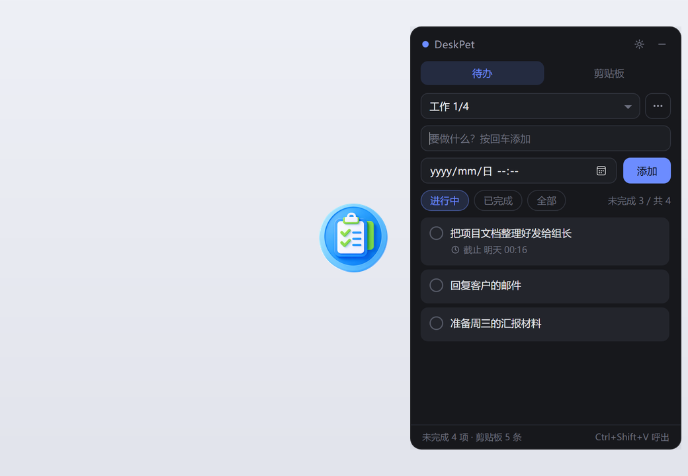
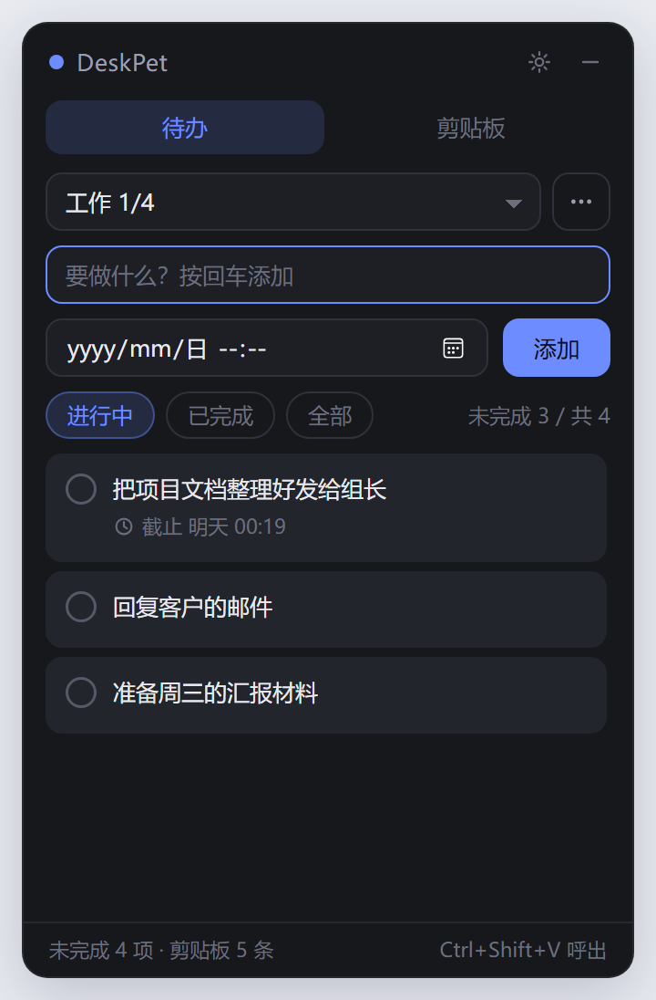
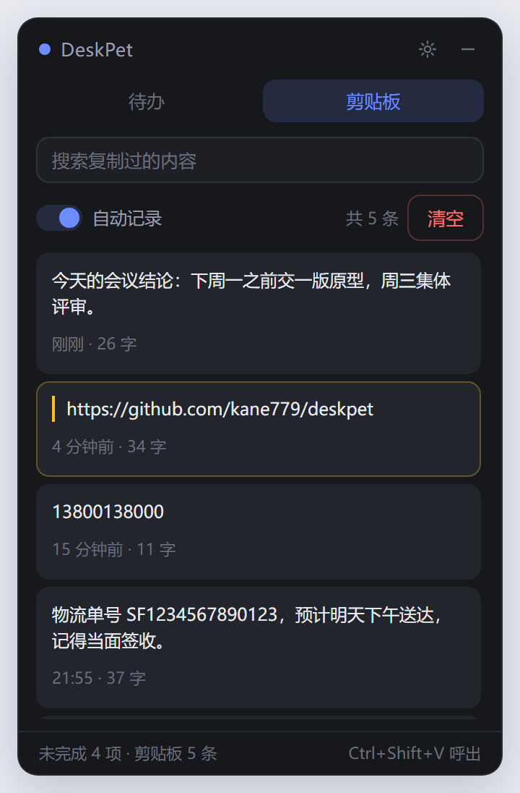
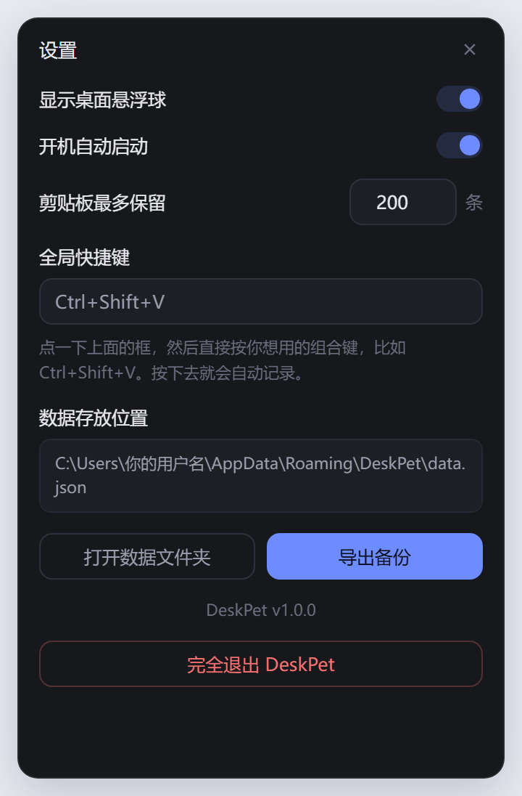

# DeskPet · 桌面小助手

一个常驻桌面的**蓝色悬浮球**，左键点一下展开成迷你面板：**待办备忘录** + **剪贴板暂存**。

所有数据都保存在你自己的电脑上，不联网、不上传、不用注册账号。



悬浮球待在桌面上（上图左侧那颗球）。**左键点一下**，面板就展开在它旁边；**再点一下**，收回去。

---

## 界面预览

### 待办备忘录

写下要做的事，按回车就添加。做完**点一下左边的圆圈**打钩——会划掉变灰，但记录不会删掉。

可以建多个待办列表（工作 / 购物 / 学习……），也能给某件事设截止时间，到点弹系统通知。



### 剪贴板暂存

你按 `Ctrl+C` 复制的内容会**自动**排到这里，不用做任何操作。

点一下某条就能把它复制回剪贴板。重要的点右侧**书签图标置顶**（上图中那条黄色边框的），置顶的永远不会被自动清理。



### 设置

悬浮球开关、开机自启、保留条数、全局快捷键、数据导出都在这里。



---

## 它能做什么

### 桌面悬浮球

| 操作 | 效果 |
| --- | --- |
| **左键单击** | 展开 / 收起面板 |
| **按住拖动** | 把球挪到桌面任意位置，松手后自动记住 |
| **右键单击** | 把球藏起来（面板一起收起），桌面立刻干净 |

面板会出现在悬浮球**旁边**（左边放不下就自动换到右边），并且垂直居中对齐那颗球——始终跟着球走，不会跑到屏幕另一边。

### 待办备忘录

- 可以建**多个待办列表**（工作、购物、学习……各自独立）
- 写下要做的事，做完**点一下左边的圆圈** → 打钩、划掉、变灰，但记录**不会被删除**
- 可以给某件事设**截止时间**，到点弹系统通知提醒你
- 按「进行中 / 已完成 / 全部」三种视图查看，随时翻历史

### 剪贴板暂存

- 你按 `Ctrl+C` 复制的内容，会**自动**出现在列表最上面，不需要任何手动操作
- 想分几次复制、再一起粘贴？都在这里排队等着，**点一下就把那段文字复制回剪贴板**
- 默认最多保留 **200 条**，超出自动删最旧的（数量可以自己改）
- 重要的条目可以**置顶**，置顶的永远不会被自动清理
- 支持关键词搜索

### 顺手的地方

- **始终在别的窗口上面**，不会被挡住
- **开机自动启动**，平时安静地待在右下角托盘，不占地方
- **全局快捷键**（默认 `Ctrl+Shift+V`，可在设置里改成任意组合键）一键把球和面板都叫出来
- **一键导出备份**，导出成 Markdown / TXT / JSON，方便换电脑

---

## 下载安装

到本仓库的 **Releases** 页面下载对应你系统的安装包：

| 你的系统 | 下载哪个文件 |
| --- | --- |
| Windows | `DeskPet Setup x.x.x.exe`（安装版，会创建桌面图标）<br>`DeskPet x.x.x.exe`（免安装绿色版，双击即用） |
| macOS（Apple 芯片 M1/M2/M3/M4） | `DeskPet-x.x.x-arm64.dmg` |
| macOS（Intel 芯片） | `DeskPet-x.x.x-x64.dmg` |

> 找不到 Releases？点仓库页面右侧的 **Releases**，或直接访问 `你的仓库地址/releases`。

### macOS 用户第一次打不开？

因为没有花钱买苹果的开发者签名，macOS 会提示「无法打开，因为无法验证开发者」。两选一解决：

**方法一（推荐）**：在「应用程序」文件夹里找到 DeskPet，**按住 Control 键点它**，在弹出菜单里选「打开」，然后点「打开」。只需要做一次。

**方法二**：打开「终端」，粘贴下面这行回车，之后再正常双击即可。

```bash
xattr -cr /Applications/DeskPet.app
```

---

## 怎么用

启动后，桌面上会出现一颗**蓝色悬浮球**，面板默认是收起的。

| 想做的事 | 怎么做 |
| --- | --- |
| 展开 / 收起面板 | **左键点一下悬浮球**（或按 `Ctrl+Shift+V`） |
| 把悬浮球挪个位置 | **按住球拖动**，松手后自动记住位置 |
| 让悬浮球暂时消失 | **右键点一下球**（面板也会一起收起） |
| 再把球叫回来 | 按 `Ctrl+Shift+V`，或右键托盘图标 →「显示悬浮球」 |
| 只收起面板、保留球 | 点面板右上角的 **－** |
| 用托盘图标操作 | 右键托盘图标有完整菜单；Windows 上左键单击 = 显示球并收起/展开面板 |
| 彻底退出程序 | 面板右上角 **⚙ 设置** → 最下面「完全退出 DeskPet」 |

> 面板上的 **－** 只是收起，程序仍在后台运行——因为待办提醒需要它一直活着。

### 待办怎么用

| 想做的事 | 怎么做 |
| --- | --- |
| 添加一条 | 在上面的输入框打字，按**回车**（或点右边的「添加」） |
| 标记完成 | 点这条待办**左边的圆圈** |
| 改内容或改截止时间 | 鼠标移到这条上，点**铅笔图标** |
| 删除一条 | 鼠标移到这条上，点**叉号** |
| 换 / 新建待办列表 | 上方下拉框切换；右边的 **⋯** 里可以新建、重命名、删除 |
| 设提醒 | 添加前先在下面一行选一个时间，到点会弹系统通知 |

### 剪贴板怎么用

| 想做的事 | 怎么做 |
| --- | --- |
| 记录新内容 | 什么都不用做，正常复制就行 |
| 把某条复制回去 | **点一下那条**（或点它右边的复制图标） |
| 置顶保护 | 点那条右侧的**书签图标**，防止被自动清理 |
| 删除一条 | 点那条右侧的**叉号** |
| 暂时不记录 | 关掉「自动记录」开关（或用托盘菜单） |
| 清空历史 | 点「清空」（已置顶的条目会保留） |

---

## 我的数据存在哪？

数据全部保存在你电脑本地的一个 JSON 文件里，**不联网、不上传**：

| 系统 | 位置 |
| --- | --- |
| Windows | `C:\Users\你的用户名\AppData\Roaming\DeskPet\data.json` |
| macOS | `~/Library/Application Support/DeskPet/data.json` |

最方便的办法：打开 **⚙ 设置** → 点「**打开数据文件夹**」，会直接帮你打开这个目录。

想备份就复制 `data.json`；想彻底清空就删掉它（程序下次启动会重新建一个空的）。

---

## 常见问题

**Q：悬浮球不见了怎么办？**
A：三种办法叫回来：①按全局快捷键（默认 `Ctrl+Shift+V`）；②右键右下角托盘图标 →「显示悬浮球」；③打开设置面板，把「显示桌面悬浮球」开关打开。

**Q：鼠标点悬浮球没反应？**
A：先试着拖动一下球确认它没被别的置顶窗口挡住。另外球的点击范围就是那颗圆的区域，点在窗口四角透明处是不会响应的。

**Q：为什么点了 － 程序还在？**
A：那不是关闭，是收起面板。因为你要它开机自启和到点提醒，程序必须一直活着。真要退出，请在**设置 → 完全退出**，或右键托盘图标 →「退出 DeskPet」。

**Q：为什么到点了没弹提醒？**
A：提醒依赖系统通知。Windows 上如果开了「专注助手 / 免打扰」可能会被折叠到通知中心里。另外请确认程序正在运行（托盘里有图标）。

**Q：剪贴板会不会记录我的密码？**
A：会记录你复制的**任何文字**，包括密码。所以：复制完密码后建议手动删掉那一条，或者在处理敏感信息时先关掉「自动记录」开关。所有记录只存在你本机，不会外传。

**Q：会记录图片或者文件吗？**
A：目前版本只记录**文字**。图片和文件暂不支持。

**Q：占多少资源？**
A：安装包约 78 MB，运行时占用内存约 150–300 MB。这是 Electron 桌面应用的正常水平。

**Q：自己本地打包时报错 `Cannot create symbolic link ... libcrypto.dylib`？**
A：这是 electron-builder 在 Windows 上的已知问题——它解压签名工具时想创建 macOS 的符号链接，而普通账户没有这个权限。三个办法任选：①以**管理员身份**打开终端再打包；②在「设置 → 隐私和安全性 → 开发者选项」里打开**开发者模式**；③**不管它**，把代码推到 GitHub 让 Actions 自动打包（最省事）。另外，出现这个报错时 `dist/win-unpacked/DeskPet.exe` 通常已经生成好了，那是一个可以直接运行的绿色版。

---

## 自己改代码

想改界面颜色、文字、功能都可以，不需要很深的编程基础。

```bash
# 1. 安装依赖（只需要做一次）
npm install

# 2. 本地运行，改完代码保存后按 Ctrl+R 刷新界面就能看到效果
npm start

# 3. 打包成安装包，产物在 dist 目录
npm run dist
```

几个最常改的地方：

| 想改什么 | 改哪个文件 |
| --- | --- |
| 界面配色（深色/浅色、主色调） | `src/renderer/styles.css` 最上面那几行颜色变量 |
| 文字提示、按钮名字 | `src/renderer/index.html` |
| 面板的界面交互 | `src/renderer/renderer.js` |
| 悬浮球的样子和点击行为 | `src/renderer/ball.html`、`ball.css`、`ball.js` |
| 悬浮球大小、面板出现的位置 | `src/main/main.js` 顶部的 `BALL_SIZE`、`BALL_GAP` |
| 剪贴板最多留几条、默认快捷键 | `src/main/store.js` 里的 `defaults()` |
| 应用图标 / 悬浮球图标 | 替换 `design/ball-icon-source.png`，然后运行 `python tools/make-icons.py` 重新生成 |
| README 里的界面截图 | 改完界面后运行 `tools/make-screenshots.ps1`（右键 → 使用 PowerShell 运行）自动重截 |

---

## 自动打包（给不想在自己电脑上折腾的人）

仓库里带了 GitHub Actions 配置（`.github/workflows/build.yml`）。

你只要把代码推送到 GitHub 的 `main` 分支，GitHub 就会**免费**在云端帮你在 Windows 和 macOS 两套系统上各打一次包，生成 `.exe` 和 `.dmg` 安装文件。

打包完成后：

1. 打开仓库页面 → 顶部 **Actions** 标签
2. 点最新那次运行记录
3. 页面底部 **Artifacts** 区域即可下载 `DeskPet-Windows` / `DeskPet-macOS`

> 注意：**Artifacts 必须登录 GitHub 才能下载**，不适合直接分享给别人。要让任何人都能下载，用下面这种方式。

### 打标签 → 自动创建发布页

推送一个以 `v` 开头的标签，GitHub 会自动打包**并创建 Release 发布页**，任何人都能直接下载，**不需要 GitHub 账号**：

```bash
git push origin main      # 先推送代码
git tag v1.0.0            # 打版本标签（每个版本号只能用一次）
git push origin v1.0.0    # 推标签 → 触发打包 + 自动发布
```

等 5–10 分钟，打开仓库的 `/releases` 页面就能看到安装包了。

---

## 开源协议

[MIT](LICENSE) —— 随便用、随便改、可以商用，保留版权声明即可。
